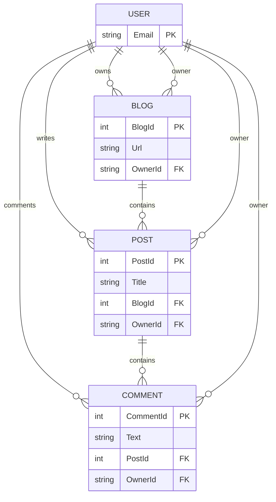

# EF Core Benchmark: SplitQuery vs SingleQuery

This project benchmarks the performance of Entity Framework Core's `AsSingleQuery()` and `AsSplitQuery()` loading modes using synthetic data generated with [Bogus](https://github.com/bchavez/Bogus) and measured with [BenchmarkDotNet](https://benchmarkdotnet.org/). It uses a SQL Server database running in a Docker container.

## 🗺️ Entity and Relationship Diagram



> **Notes:**
>
> - A user can own blogs, posts, and comments.
> - A blog contains many posts, and a post contains many comments.
> - Foreign keys (`OwnerId`, `BlogId`, `PostId`) link the entities.

## 🚀 Usage Instructions

### 1. Start SQL Server in Docker

```bash
docker-compose up -d
```

This will start a container named `sql_benchmark_test` with SQL Server 2022 on port `1433` and password `Your_password123`.

### 2. Run the Benchmark

```bash
cd EfBenchmark
dotnet run -c Release
```

You can configure the benchmark parameters in `Program.cs` using the `[Params]` attributes:

- `BlogCount`: 1 or 10,000 blogs
- `PostsPerBlog`: 10,000 or 1 post per blog
- `CommentsPerPost`: 1 or 10 comments per post
- `OwnerCount`: 1 to 10 owners (users)

By default, the benchmark will generate the number of blogs, posts, comments, and owners according to these parameters. Adjust them to simulate different data volumes and user distributions.

BenchmarkDotNet will run both `AsSingleQuery()` and `AsSplitQuery()` and measure:

- Execution time
- Memory usage
- Allocations

## 📊 Expected Results

Results and analysis will be added soon.
